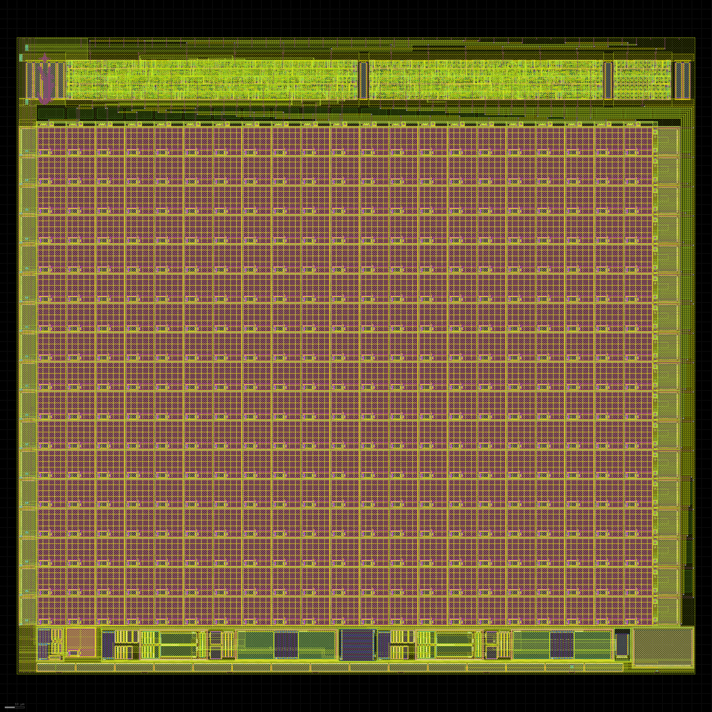

 

# Tiny Tapeout - Openschnapp 3T CMOS Image Sensor
- [Read the documentation for the project](docs/info.md)
- [Check the GDS viewer for the current project state](https://baal86.github.io/ttgf-analog-openschnapp/)

Mixed signal design of freely addressable photo diode array. Made as a learning project in the Zero2Asic analog course. Documentation per IP block in the `docs` folder:

- [Pixel Array Current Source](https://github.com/baal86/ttgf-analog-openschnapp/tree/main/docs/current_source)
- [ND2PS Photo Diode Pixel](https://github.com/baal86/ttgf-analog-openschnapp/tree/main/docs/pixel)
- [Column Multiplexer](https://github.com/baal86/ttgf-analog-openschnapp/tree/main/docs/column_mux)

A snapshot of top level design is shown below.

## What is Tiny Tapeout?

Tiny Tapeout is an educational project that aims to make it easier and cheaper than ever to get your digital designs manufactured on a real chip.

To learn more and get started, visit https://tinytapeout.com.

## Analog projects

For specifications and instructions, see the [analog specs page](https://tinytapeout.com/specs/analog/).

## Resources

- [FAQ](https://tinytapeout.com/faq/)
- [Digital design lessons](https://tinytapeout.com/digital_design/)
- [Learn how semiconductors work](https://tinytapeout.com/siliwiz/)
- [Join the community](https://tinytapeout.com/discord)
