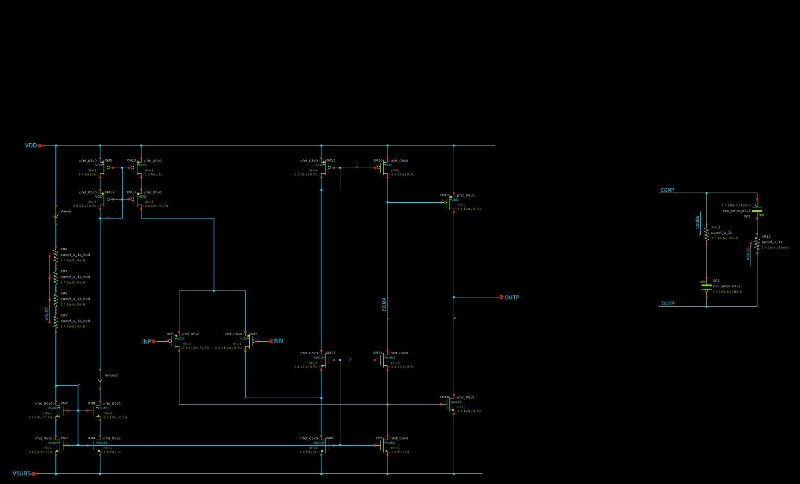
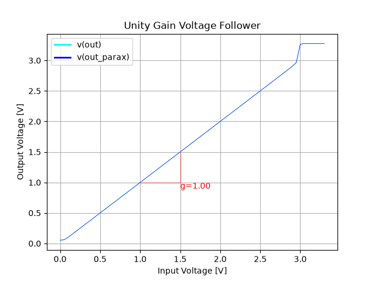
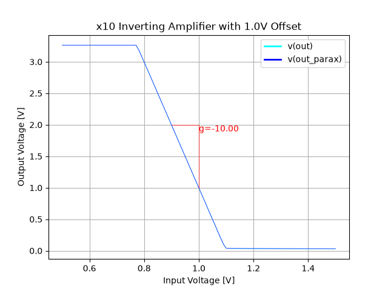
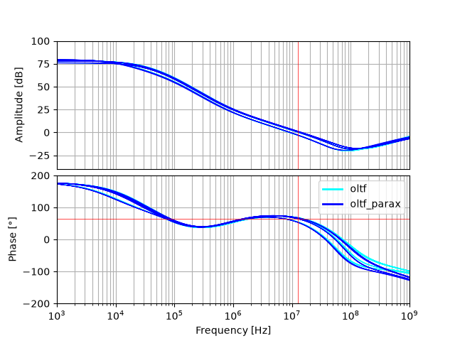
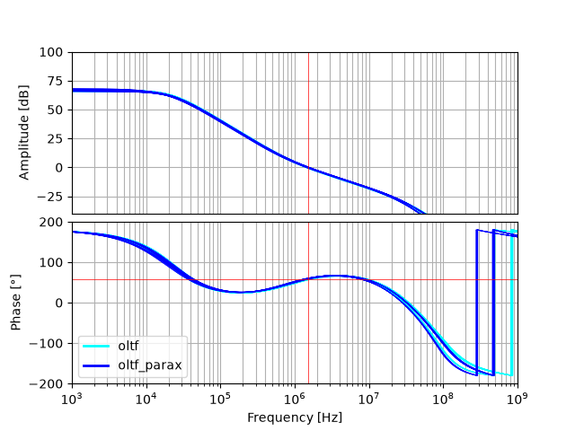
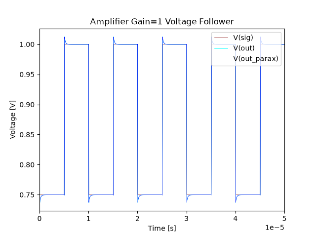
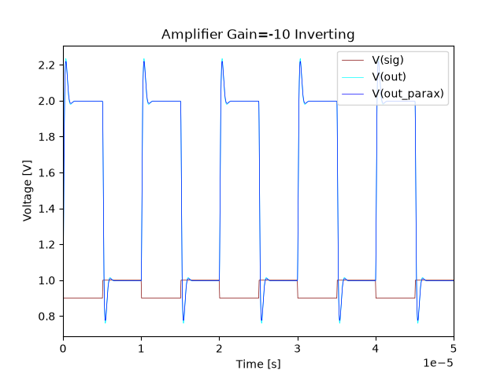
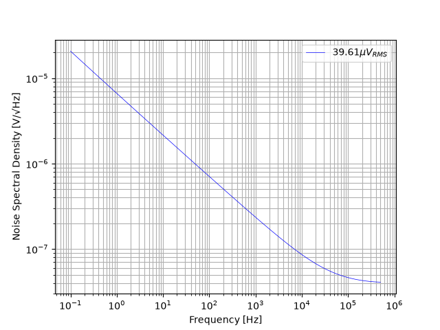

## Amplifier
A basic OP-amp building block for use in signal processing circuitry. Compensation using `PMOSCAP` devices is not ideal and the design would benefit from the availability of `MIM` capacitors in gf180mcu Tiny Tapeout. The compensation is mid-point biased to `VDD` which brings the risk of poor power supply rejection. 

The amplifier is simulated to work in two modes needed for the signal processing of the image sensor:

- Unity gain voltage follower
- x10 Gain inverting amplifier with 1.0V offset voltage.

### DC Transfer Function
A DC transfer function is simulated to test for the valid I/O range.

In unity gain mode the amplifier operates within $0.1V$ of VSS and $0.6V$ of VDD. The amplifier is design for low input voltages closer to VSS than VDD (thus choosing PMOS input devices) so the upper range is not thoroughly characterized.

In inverting mode The $0.8V$ to $1.01V$ range around a $1.0V$ reference connected to `IN+` is linear and exhibits the desired gain of x10. 

### Stability Simulation
DC bias for both configurations is simulated in the 0.5V to 1.5V range which is most useful for the signals at hand.

For both configurations a minimum phase margin of $45\deg$ is required with a typical goal of $60\deg$. Gain bandwidth product is design to be $>10MHz$.

### Transient Simulation
The transient behavior is simulated for both relevant configurations.

For the voltage follower configuration a $0.75V$ to $1V$ rectangular signal representative of the image sensor source follower is simulated. Observed overshoot is acceptable, no oscillation.

For the inverting configuration a $0.9V$ to $1V$ rectangular signal representative of the image sensor source follower is simulated with `IN+` fixed at the dummy pixel level of `1V`. Observed overshoot is acceptable, no oscillation. Likely the overshoot is caused by limited slew rate of the amplifier.

### Noise Simulation
Input referenced noise is simulated. We are severely space limited with the amplifier so degrading noise performance of the pixels ($~36\mu V_{RMS}$) is accepted. The unbuffered output of the source follower is available on an analog I/O pin so noise characteristics of the source follower and pixel can be characterized that way.

