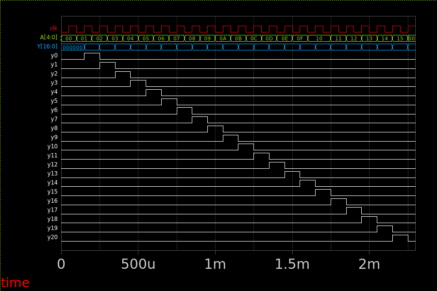

## Column Multiplexer
A clock-synchronous 5:21 de-multiplexer that gives:

- No column activated if A[4:0] = 0b00000
- A single column activated for other values of A

The multiplexer is implemented in Verilog.

### Timing Diagram
Timing diagram to visualize functionality.

