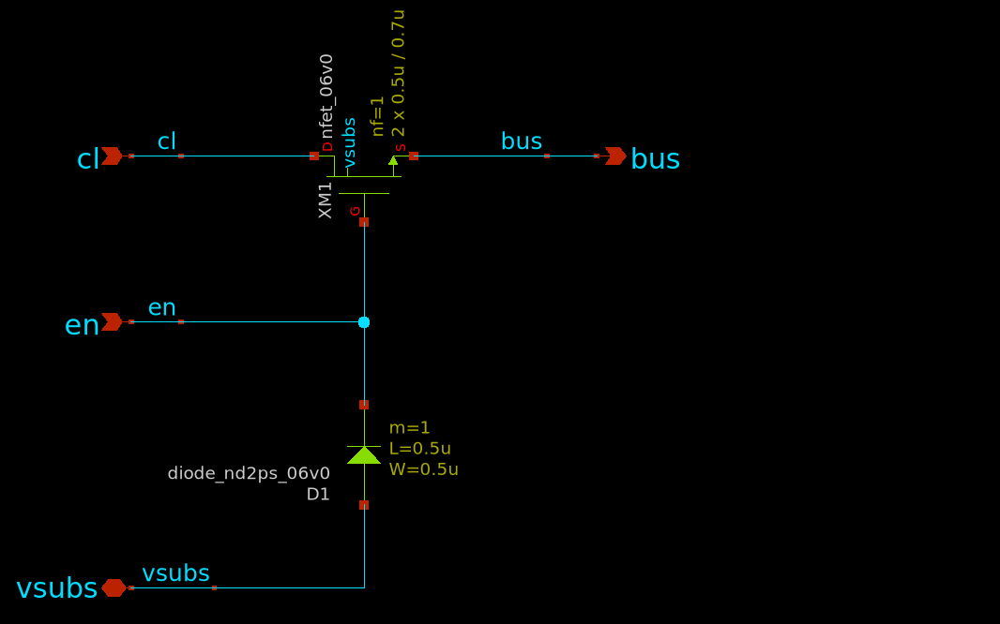
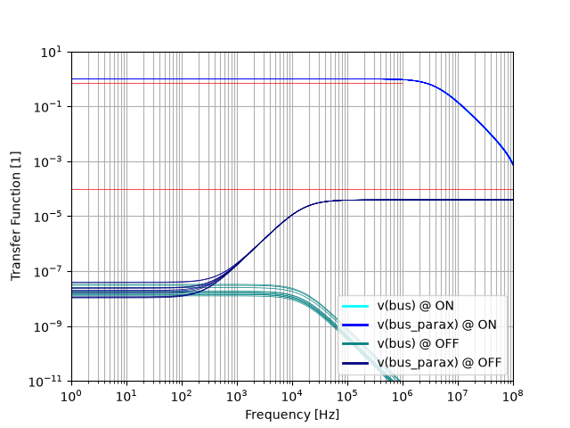

## Column Switch
Select the column to be connected to the current source bus. The diode is only present to protect the large enable net during production (antenna diode).

### Transfer Function Simulation
AC transfer function is simulated. We aim for flat transfer function up to 1MHz when the switch is on and >80dB isolation when the switch is of. Note the significant difference in off-performance between ideal and post-layout simulation.

