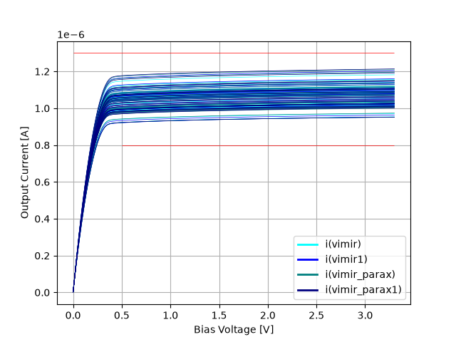
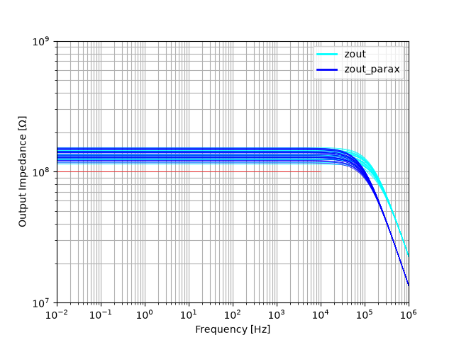

## Current Source
A low-side current source with two outputs, one for the pixel array, the other for the dummy pixel.

### Output Current Simulation
DC current output is simulated to be at 1uA under all conditions.

### Output Impedance Simulation
Output impedance is simulated.

