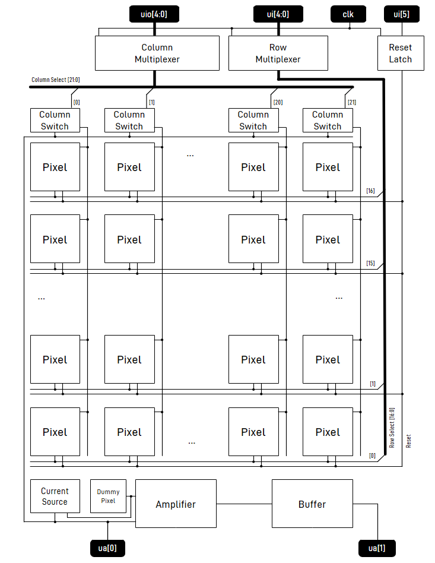

<!---

This file is used to generate your project datasheet. Please fill in the information below and delete any unused
sections.

You can also include images in this folder and reference them in the markdown. Each image must be less than
512 kb in size, and the combined size of all images must be less than 1 MB.
-->

## How it works

A classic 3T CMOS image sensor. Diode performance will be poor, but hopefully the readout can be demonstrated. Most pixels are masked by `metal5` but the available pixels should allow characterization of the image sensor.

Further documentation for single IP blocks in the folders listed below.

- [https://github.com/baal86/ttgf-analog-openschnapp/blob/main/docs/pixel/README.md](https://github.com/baal86/ttgf-analog-openschnapp/blob/main/docs/pixel/README.md)
- [https://github.com/baal86/ttgf-analog-openschnapp/blob/main/docs/current_source/README.md](https://github.com/baal86/ttgf-analog-openschnapp/blob/main/docs/current_source/README.md)
- [https://github.com/baal86/ttgf-analog-openschnapp/blob/main/docs/column_mux/README.md](https://github.com/baal86/ttgf-analog-openschnapp/blob/main/docs/column_mux/README.md)
- [https://github.com/baal86/ttgf-analog-openschnapp/blob/main/docs/row_mux/README.md](https://github.com/baal86/ttgf-analog-openschnapp/blob/main/docs/row_mux/README.md)
- [https://github.com/baal86/ttgf-analog-openschnapp/blob/main/docs/column_switch/README.md](https://github.com/baal86/ttgf-analog-openschnapp/blob/main/docs/column_switch/README.md)
- [https://github.com/baal86/ttgf-analog-openschnapp/blob/main/docs/total/README.md](https://github.com/baal86/ttgf-analog-openschnapp/blob/main/docs/total/README.md)

## How to test

For simple uncorrelated readout:

- Apply a 200kHz clock to the `clk` pin of the chip. This synchronizes the column select, row select and reset signals.
- Pulse reset high, then low to reset the array using the `ui[5]` signal. The reset signal is latched at the rising edge of the chip clock.
- Wait for your desired integration time. Try 1ms to start with.
- Read out the image sensor. Do for each pixel in the array.
    - Address the pixel by row and column number using the `ui[4:0]` and `uio[4:0]` signals. Column and row select are latched at the rising edge of the chip clock.
    - After settling, sample the video output signal `ua[0]` or buffered signal `ua[1]` using the development board ADC. The falling edge of the chip clock is a suitable trigger signal, although it would be advantageous to choose a sample point right before the next pixel is addressed to maximize sample time.

More advanced readout modes like correlated double sampling (CDS) and up-the ramp should be possible but the capability of the image sensor for non-destructive read needs to be tested first for the latter.