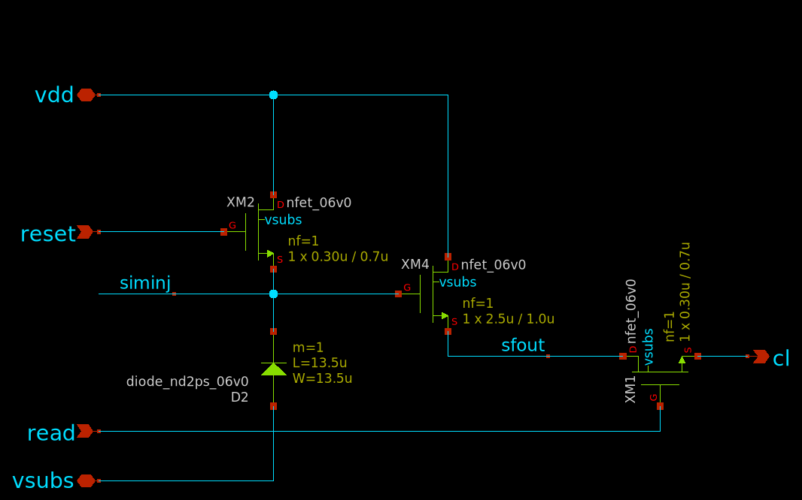
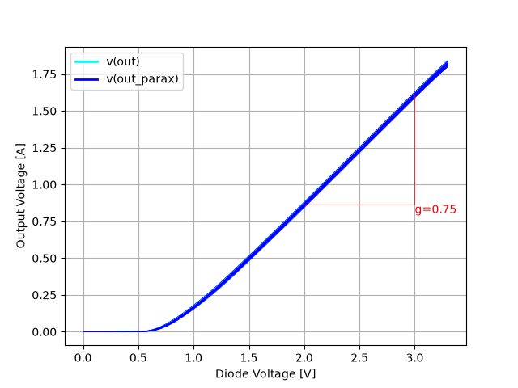
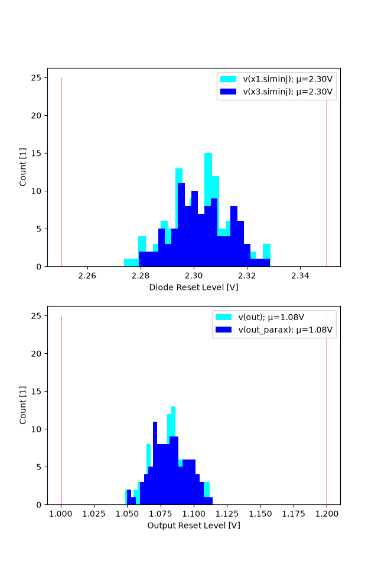
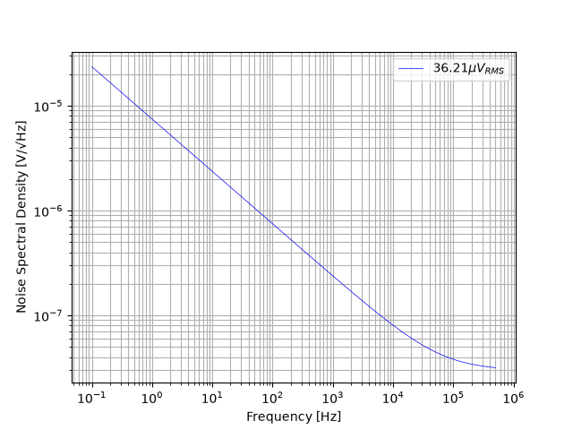
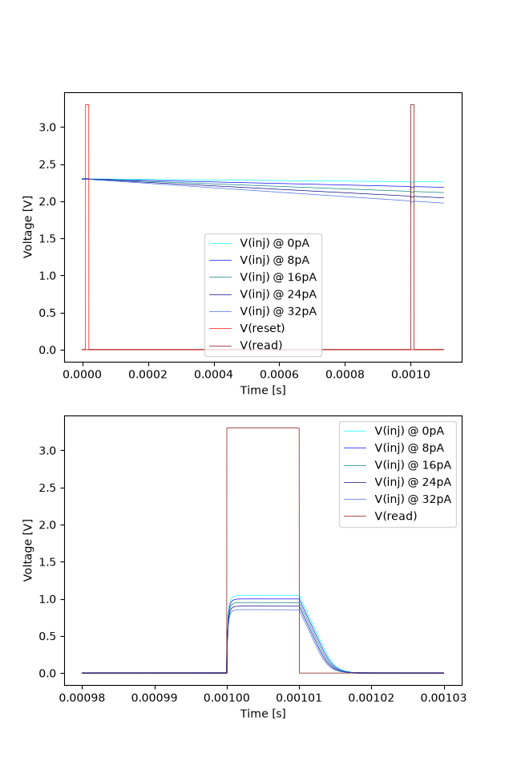

## Pixel Design
The `nd2ps` diode pixel. Designed to be infinitely tiled with no routing in magic.

### Calculations

Generated from calculations.cpd sheet. Use with calcpadCE. 

<h4>Unit Definitions</h4> 

We operate in the low current domain so we define fX units. 

<i>ec</i> = 1.6 · 10-19 <i>C</i> = 1.6×10-19 <i>C</i>

<i>fA</i> = 0.001 <i>pA</i>

<i>fC</i> = 0.001 <i>pC</i>

<i>fF</i> = 0.001 <i>pF</i>

&nbsp;

<h4>Photo Current Calculation</h4> 

The desired full-well capacity is defined. All calculations in electrons since QE cannot be estimated and will be poor due to <i>metal5</i> and lack of AR-coating and passivation. 

<var>N</var>WELL = 200000

<var>C</var>WELL = <var>N</var>WELL · 1 <i>ec</i> = 200000 · 1 <i>ec</i> = 32.04 <i>fC</i>

&nbsp;

Typical integration time to fill the well from experience with similar test setups. 

<var>t</var>MAX = 1 <i>s</i>

&nbsp;

Resulting photo current for full well within one second: 

<var>I</var>PHOTO = <var>C</var>WELL<em> / </em><var>t</var>MAX = 32.04 <i>fC</i><em> / </em>1 <i>s</i> = 32.04 <i>fA</i>

&nbsp;

<h4>Diode Voltage and Sensitivity</h4> 

Diode capacitance based on size. 

<var>CJ</var>ND2PS = 1 <i>fF</i><i class="unit"> ∕ </i><i>μm</i>2

<var>W</var>D = 13.5 <i>μm</i>

<var>L</var>D = 13.5 <i>μm</i>

<var>C</var>D = <var>CJ</var>ND2PS · <var>W</var>D · <var>L</var>D = 1 <i>fF</i><i class="unit"> ∕ </i><i>μm</i>2 · 13.5 <i>μm</i> · 13.5 <i>μm</i> = 182.25 <i>fF</i>

&nbsp;

Resulting diode voltage at full well. 

<var>V</var>D = <var>I</var>PHOTO<em> / </em><var>C</var>D · <var>t</var>MAX = 32.04 <i>fA</i><em> / </em>182.25 <i>fF</i> · 1 <i>s</i> = 0.176 <i>V</i>

&nbsp;

Sensitivity with simulated source follower gain. 

<var>G</var>SF = 0.75

<var>B</var> = <var>G</var>SF · <var>V</var>D<em> / </em><var>C</var>WELL = 0.75 · 0.176 <i>V</i><em> / </em>32.04 <i>fC</i> = 0.659 <i>μV</i><i class="unit"> ∕ </i><i>ec</i>

&nbsp;

Noise estimation with simulated source follower gain. 

<var>V</var>N = 35 <i>μV</i>

<var>N</var>N = <var>V</var>N<em> / </em><var>B</var> = 35 <i>μV</i><em> / </em>0.659 <i>μV</i><i class="unit"> ∕ </i><i>ec</i> = 53.08 <i>ec</i>

&nbsp;

<h4>Dark current estimate</h4> 

Diffusion method only valid around room temperature 

<var>kB</var> = 1.38 · 10-23 <i>J</i><i class="unit"> ∕ </i><i>K</i> = 8.62×10-5 <i>eV</i><i class="unit"> ∕ </i><i>K</i>

<var>T</var>OP = 293.15 <i>K</i>

<var>T</var>REF = 298.15 <i>K</i>

&nbsp;

Reference temperature from GF180 spice model. 

Area and perimeter dependent current. Parameters frm GF180 diode spice model 

<var>I</var>SA = 2.3 · 10-7 <i>A</i><i class="unit"> ∕ </i><i>m</i>2 = 2.3×10-7 <i>A</i><i class="unit"> ∕ </i><i>m</i>2

<var>A</var> = <var>W</var>D · <var>L</var>D = 13.5 <i>μm</i> · 13.5 <i>μm</i> = 182.25 <i>μm</i>2

<var>J</var>SW = 2.12 · 10-13 <i>A</i><i class="unit"> ∕ </i><i>m</i> = 2.12×10-13 <i>A</i><i class="unit"> ∕ </i><i>m</i>

<var>P</var> = 2 · <var>W</var>D + 2 · <var>L</var>D = 2 · 13.5 <i>μm</i> + 2 · 13.5 <i>μm</i> = 54 <i>μm</i>

&nbsp;

Total base current. 

<var>I</var>S = <var>I</var>SA · <var>A</var> + <var>J</var>SW · <var>P</var> = 2.3×10-7 <i>A</i><i class="unit"> ∕ </i><i>m</i>2 · 182.25 <i>μm</i>2 + 2.12×10-13 <i>A</i><i class="unit"> ∕ </i><i>m</i> · 54 <i>μm</i> = 5.33×10-17 <i>A</i>

&nbsp;

Exponential parameters 

<var>XTI</var> = 3

<var>N</var> = 1.01

<var>EA</var> = 1.17 <i>eV</i>

&nbsp;

Resulting dark-current according to diffusion method: 

<var>I</var>DARK_DIFF ( <var>T</var> )  = <var>I</var>S ·  ( <var>T</var><em> / </em><var>T</var>REF ) <var>XTI</var><em> / </em><var>N</var> · <var>e</var><var>EA</var><em> / </em> ( <var>N</var> · <var>kB</var> · <var>T</var> )  ·  ( <var>T</var><em> / </em><var>T</var>REF − 1 ) 

<var>I</var>DARK_DIFF  ( <var>T</var>OP )  = <var>I</var>DARK_DIFF  ( 293.15 <i>K</i> )  = 0.0235 <i>fA</i>

<var>I</var>DARK_DIFF  ( <var>T</var>OP )  = <var>I</var>DARK_DIFF  ( 293.15 <i>K</i> )  = 146.61 <i>ec</i><i class="unit"> ∕ </i><i>s</i>

&nbsp;

<h4>Source Follower</h4> 

The source follower parameters are calculated. 

&nbsp;

Process parameters for the gf180mcuD 6.0V NFET: 

<var>C</var>OX = 0.00227 <i>pF</i><i class="unit"> ∕ </i><i>μm</i>2

<var>V</var>TH0 = 0.673 <i>V</i>

<var>μ</var>N = 525 <i>cm</i>2<em> / </em><i>V</i><i> · </i><i>s</i> = 525 <i>cm</i>2<i class="unit"> ∕ </i> ( <i>V</i><i> · </i><i>s</i> ) 

<var>k</var>n = <var>μ</var>N · <var>C</var>OX = 525 <i>cm</i>2<i class="unit"> ∕ </i> ( <i>V</i><i> · </i><i>s</i> )  · 0.00227 <i>pF</i><i class="unit"> ∕ </i><i>μm</i>2 = 119.18 <i>μA</i><i class="unit"> ∕ </i><i>V</i>2

<var>n</var> = 1.59 (Slope factor) 

<var>φ</var>F = 0.431 <i>V</i>

<var>γ</var> = 0.9 <i>V</i>1<em> / </em>2

&nbsp;

Thermal voltage 

<var>T</var> = 300 <i>K</i>

<var>k</var>B = 1.38 · 10-23 <i>J</i><i class="unit"> ∕ </i><i>K</i> = 1.38×10-23 <i>J</i><i class="unit"> ∕ </i><i>K</i>

<var>ec</var> = 1.6 · 10-19 <i>C</i> = 1.6×10-19 <i>C</i>

<var>V</var>T = <var>k</var>B · <var>T</var><em> / </em><var>ec</var> = 1.38×10-23 <i>J</i><i class="unit"> ∕ </i><i>K</i> · 300 <i>K</i><em> / </em>1.6×10-19 <i>C</i> = 0.0259 <i>V</i>

&nbsp;

Chosen width and length of the source follower FET chosen to balance space efficiency: 

<var>W</var> = 3.5 <i>μm</i>

<var>L</var> = 1.9 <i>μm</i>

&nbsp;

Specific current 

<var>I</var>SPEC = 2 · <var>n</var> · <var>k</var>n · <var>W</var><em> / </em><var>L</var> · <var>V</var>T2 = 2 · 1.59 · 119.18 <i>μA</i><i class="unit"> ∕ </i><i>V</i>2 · 3.5 <i>μm</i><em> / </em>1.9 <i>μm</i> ·  ( 0.0259 <i>V</i> ) 2 = 0.467 <i>μA</i>

&nbsp;

Bias current, iteratively set. Inversion coefficient confirms moderate inversion (0.1 < IC < 10) 

<var>I</var>D = 1 <i>μA</i>

<var>IC</var> = <var>I</var>D<em> / </em><var>I</var>SPEC = 1 <i>μA</i><em> / </em>0.467 <i>μA</i> = 2.14

&nbsp;

Calculating gm at given bias current, considering inversion coefficient. 

<var>g′</var>m = 1<em> / </em> ( <var>n</var> · <var>V</var>T )  ·  ( 1 − <var>e</var>-&ensp;&hairsp;&hairsp;√&hairsp;<var>IC</var> ) <em> / </em>&ensp;&hairsp;&hairsp;√&hairsp;<var>IC</var> = 1<em> / </em> ( 1.59 · 0.0259 <i>V</i> )  ·  ( 1 − 2.72-&ensp;&hairsp;&hairsp;√&hairsp;2.14 ) <em> / </em>&ensp;&hairsp;&hairsp;√&hairsp;2.14 = 12.77 <i>V</i>-1

<var>g</var>m = <var>g′</var>m · <var>I</var>D = 12.77 <i>V</i>-1 · 1 <i>μA</i> = 12.77 <i>μA</i><i class="unit"> ∕ </i><i>V</i>

<var>g</var>mb = 0.2 · <var>g</var>m = 0.2 · 12.77 <i>μA</i><i class="unit"> ∕ </i><i>V</i> = 2.55 <i>μA</i><i class="unit"> ∕ </i><i>V</i>

&nbsp;

Calculating voltage gain and output impedance. 

<var>A</var>v = <var>g</var>m<em> / </em> ( <var>g</var>m + <var>g</var>mb )  = 12.77 <i>μA</i><i class="unit"> ∕ </i><i>V</i><em> / </em> ( 12.77 <i>μA</i><i class="unit"> ∕ </i><i>V</i> + 2.55 <i>μA</i><i class="unit"> ∕ </i><i>V</i> )  = 0.833

<var>R</var>OUT = 1<em> / </em> ( <var>g</var>m + <var>g</var>mb )  = 1<em> / </em> ( 12.77 <i>μA</i><i class="unit"> ∕ </i><i>V</i> + 2.55 <i>μA</i><i class="unit"> ∕ </i><i>V</i> )  = 65.24 <i>kΩ</i>

&nbsp;

Iteratively determining output voltage considering the body effect. 2.3V is the simulated typical reset voltage. 

<var>V′</var>OUT = 1.1 <i>V</i>

<var>V</var>OUT ( <var>V</var>IN )  = <var>V</var>IN − <var>V</var>TH0 − <var>γ</var> ·  ( &ensp;&hairsp;&hairsp;√&hairsp;2 · <var>φ</var>F + <var>V′</var>OUT − &ensp;&hairsp;&hairsp;√&hairsp;2 · <var>φ</var>F )  − 2 · <var>n</var> · <var>V</var>T · <b>ln</b> ( <var>e</var>&ensp;&hairsp;&hairsp;√&hairsp;<var>IC</var> − 1 ) 

<var>V</var>OUT  ( 2.3 <i>V</i> )  = 1.1 <i>V</i>

### Source Follower DC Transfer Function
The source follower DC transfer function is simulated. Choice of MOSFETs for the pixel source follower is very constrained due to available space, so some compromise needs to be taken on performance.

### Pixel Reset Voltage
Pixel reset voltage both at the diode and at the output of the source follower is an important parameter for following design.

### Readout Noise
Readout noise of the source follower and current source is simulated. Note that this does not include kTC noise of the reset process itself.

### Transient Simulation
A transient simulation of a single pixel is performed. Starting at the nominal reset level (ignoring soft-reset behavior) a compressed integration period of 1ms at various diode currents (higher than normal to compensate for short exposure) is simulated. The lower plot shows the zoomed-in readout phase of the pixel.

