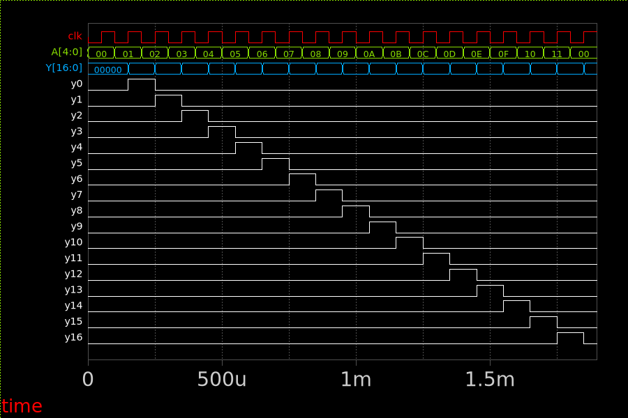

## Row Multiplexer
A clock-synchronous 5:17 de-multiplexer that gives:

- No row activated if A[4:0] = 0b00000
- A single row activated for other values of A

The multiplexer is implemented in Verilog.

### Timing Diagram

Timing diagram to visualize functionality.

> View the test-bench on [https://xschem-viewer.com](https://xschem-viewer.com/?file=https%3A%2F%2Fgithub.com%2Fbaal86%2Fttgf-analog-openschnapp%2Fblob%2Fmain%2Fxschem%2Ftb_row_mux_timing.sch)

