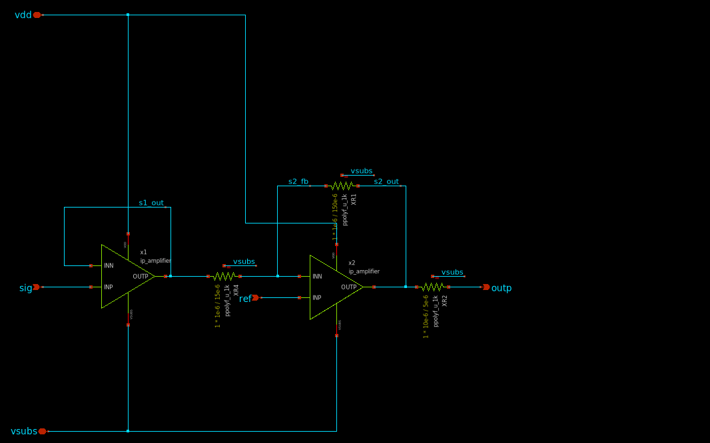
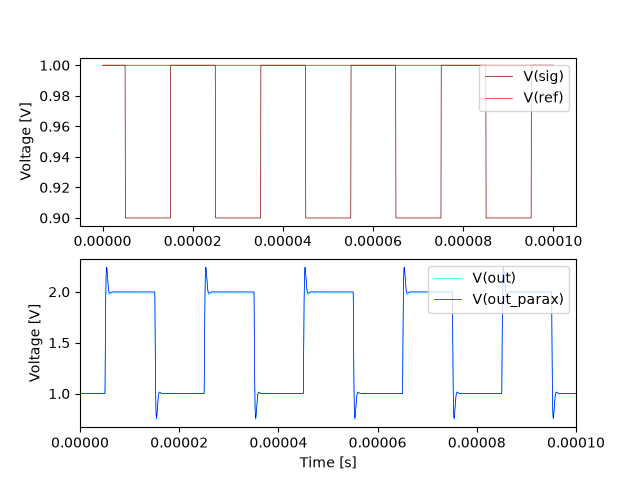

## Signal Processing
Using the basic OP-amp building block, a signal processing chain is built, containing two stages.

1) A unity gain buffer to isolate the pixel array source follower from the inverting amplifier input impedance.
2) A gain x10 inverting amplifier amplifying the difference voltage between pixel array and dummy pixel.

### Transient Simulation
The transient behavior is simulated for the worst case detector signal with a swing of $0.1V$ relative to a dummy pixel reference of $1.0V$. The OP amp has been thoroughly simulated so here only the correct choice of POLY resistors needs to be validated.

> View the test-bench on [https://xschem-viewer.com](https://xschem-viewer.com/?file=https%3A%2F%2Fgithub.com%2Fbaal86%2Fttgf-analog-openschnapp%2Fblob%2Fmain%2Fxschem%2Ftb_sigproc_tran.sch)

