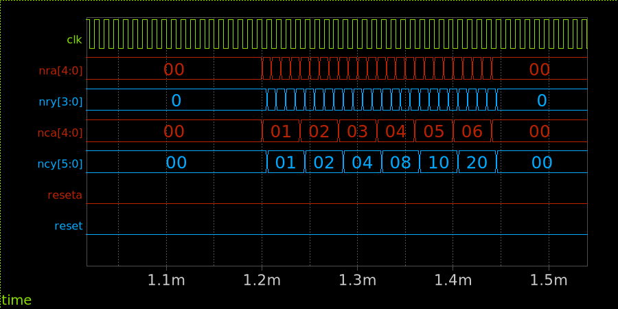
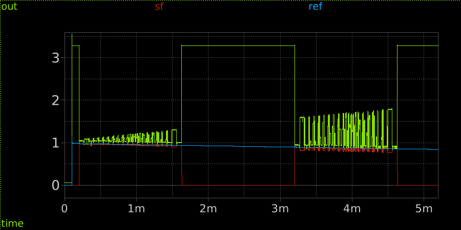
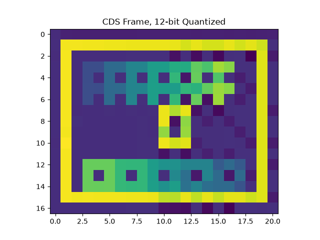

## Total Simulation
A subset of the entire image sensor is simulated. This includes co-simulation of the digital parts.  The exposure time is 1ms, but injection currents are scaled up to compensate. A test pattern image is injected. The simulation implements correlated double sampling to compensate for the photons caught during integration and to reject kTC noise (not modelled).

A timing diagram of the digital signals, clock, reset, and column/row control is shown below.

The analog signals are shown below:

- `ref` is the voltage of the reference pixel.
- `sf` is the unbuffered pixel voltage at the current source.
- `out` is the buffered video output.

The resulting image is shown below, quantized to 12bit @ 3.3V FSR as would be the case for the RP2350 ADC.

